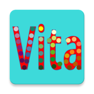

# Functionality
LifeDots is for keeping track of your life events with time and locations simply with a touch on the screen; easily adding detailed notes to any event; and analyzing your past events with various ways.

Currently you can record your current event by touching on an icon that you create, attach notes and pictures, browse your history, analize past history with statistics, and see your geo locations.

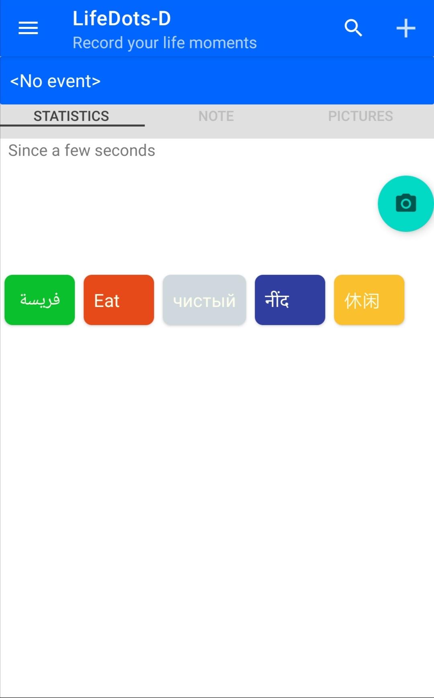 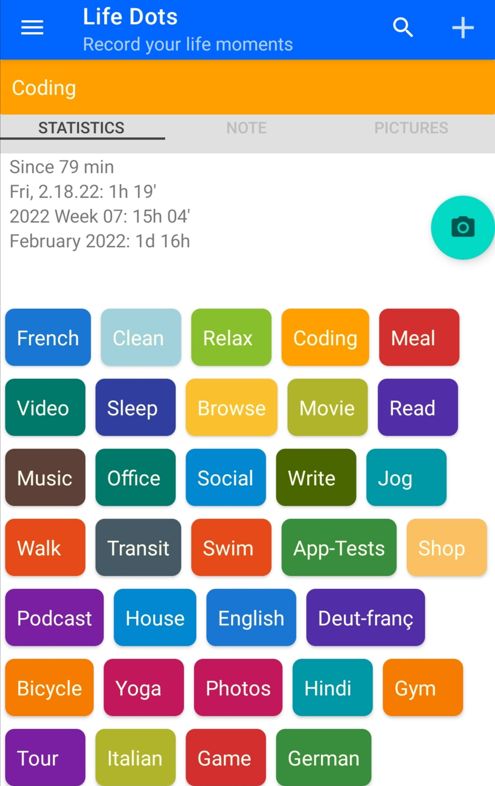  
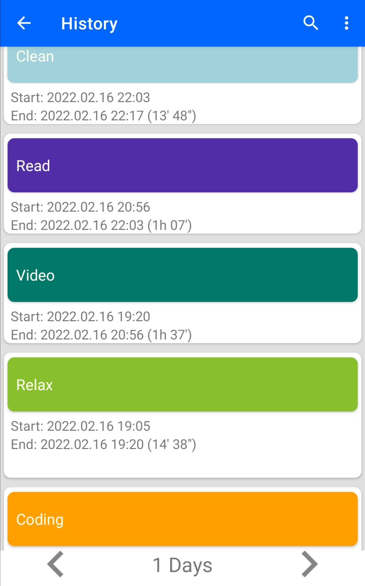 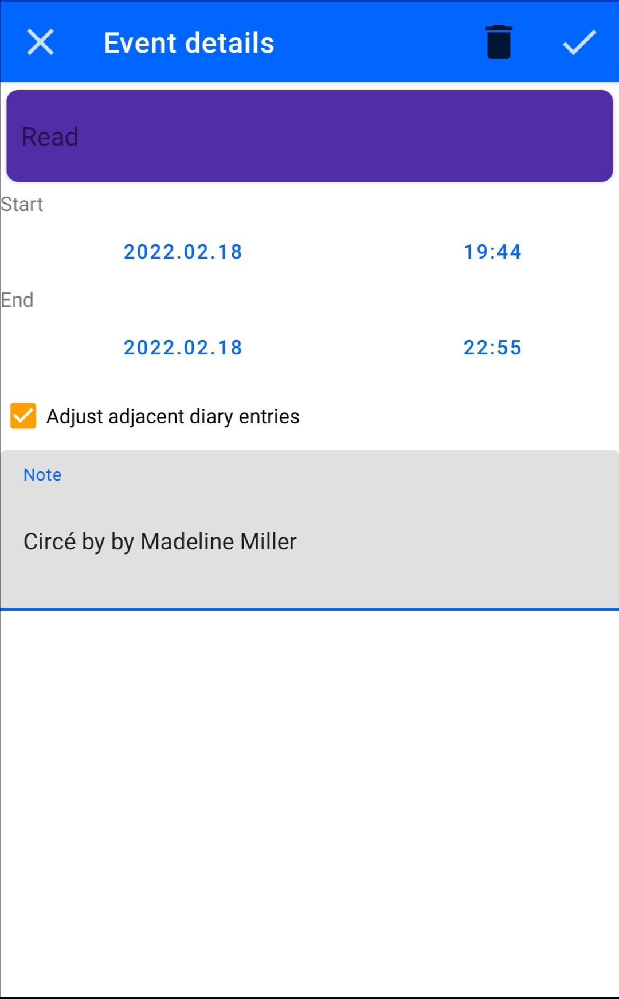  
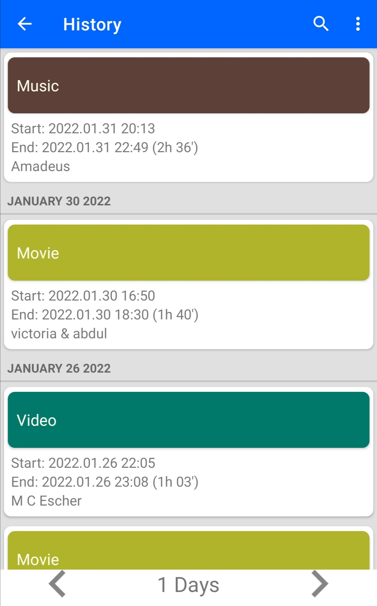 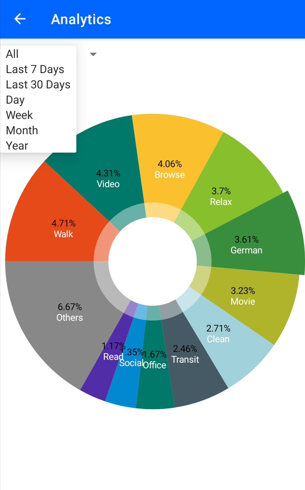  
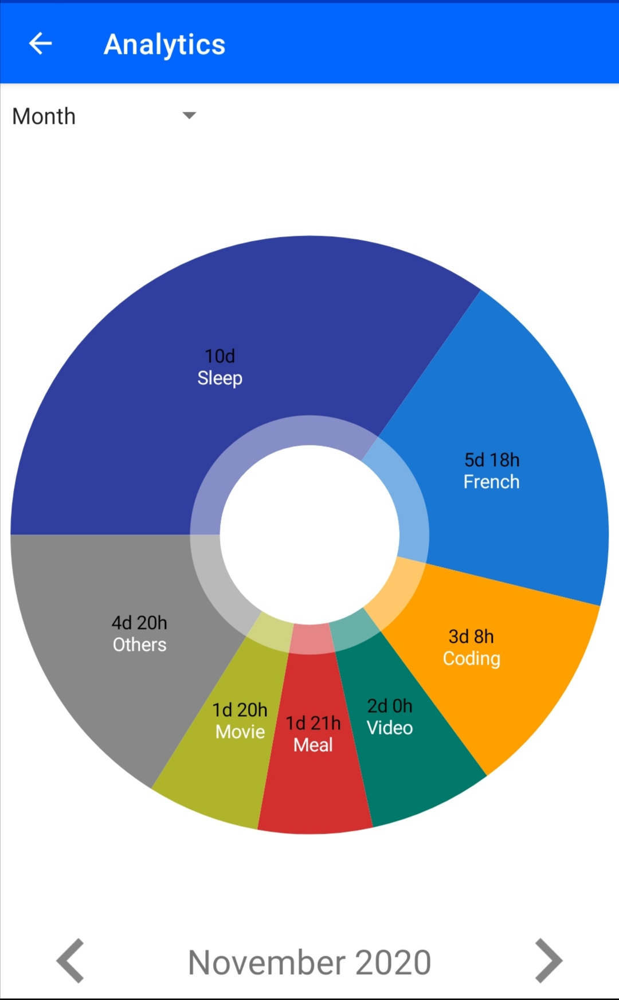 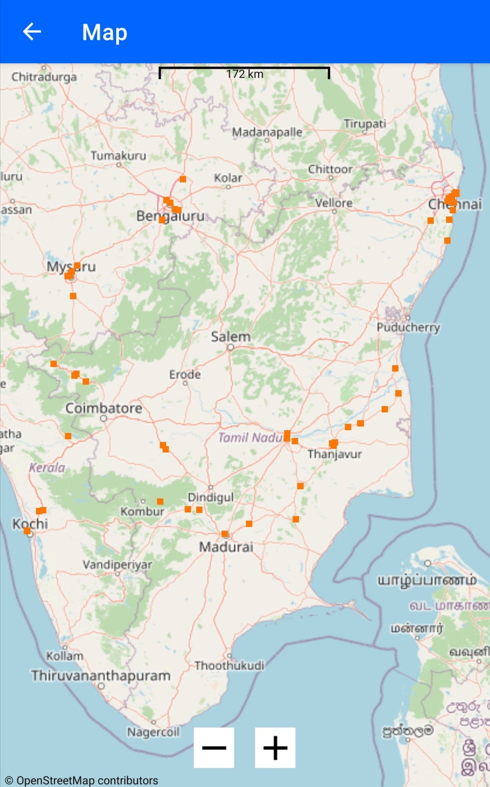  
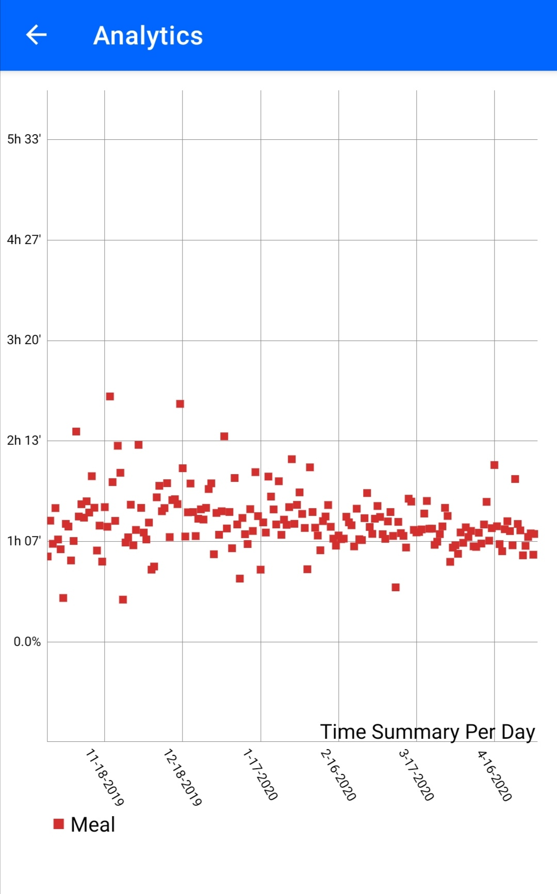 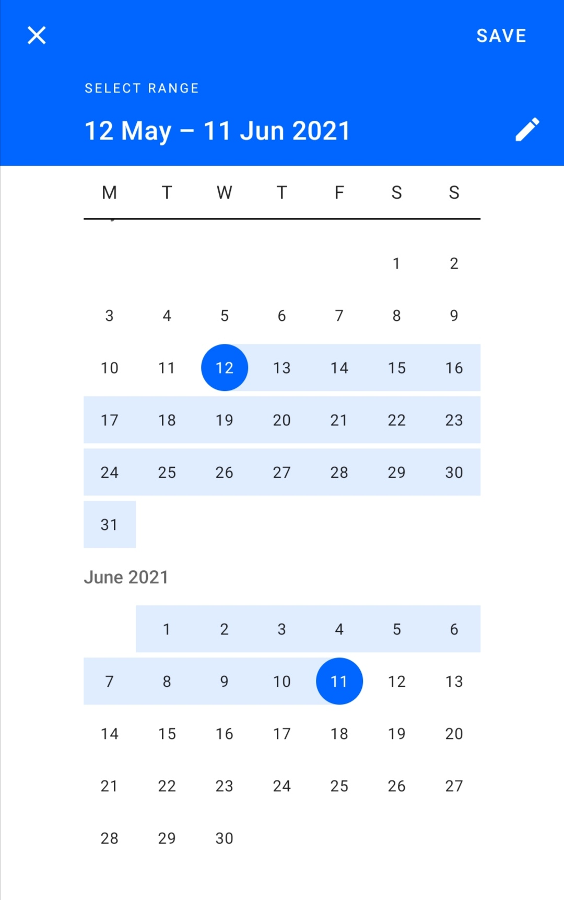  
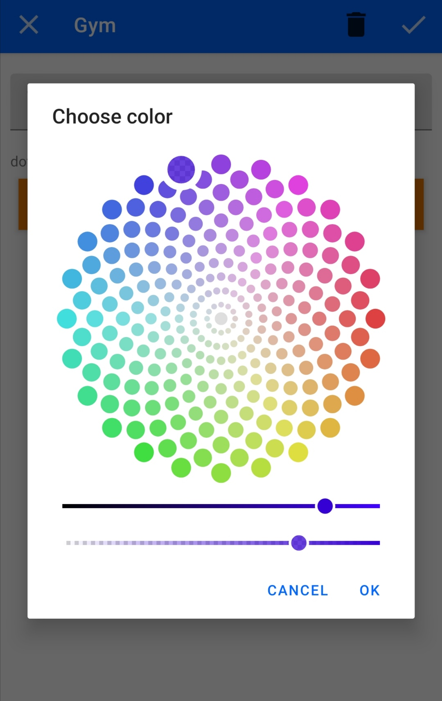

# Getting Started
LifeDots is designed to be intuitive, but if you have trouble, check out the [Frequently Asked Questions](/FAQ.md) and try the [User Guide](https://github.com/XilinJia/Life-Dots/wiki/How-to-help). In case of further trouble do not hesitate to [create a ticket](https://github.com/XilinJia/Life-Dots/issues/new) and we will try to help you and improve the documentation.

# Donations
In case you want to support the project and its developers you can do that on [Liberapay](https://liberapay.com/LifeDots).

# License and Copyright

This work is inspired by and further developed based on a fork of Activity Diary of version 1.4.0 on https://github.com/ramack/ActivityDiary.

LifeDots is free software: you can redistribute it and/or modify it under the terms of the GNU General Public License as published by the Free Software Foundation, either version 3 of the License, or (at your option) any later version.

This program is distributed in the hope that it will be useful, but WITHOUT ANY WARRANTY; without even the implied warranty of MERCHANTABILITY or FITNESS FOR A PARTICULAR PURPOSE.  See the GNU General Public License for more details.

You should have received a copy of the GNU General Public License along with this program. If not, see <https://www.gnu.org/licenses/>.

Copyright notices in this project are mostly given with a reference to the year in form of xxxx-yyyy as a short cut with the meaning, that there is a contribution in every year in the given range.

# Authors and Contribution
This app is currently under development by Xilin Jia (https://github.com/XilinJia).

Any form of contribution is warmly welcome and a [small guide how to help is in the wiki](https://github.com/XilinJia/Life-Dots/wiki/How-to-help). I am happy to read tickets with suggestions or bug reports or even better pull requests with fixes or new features. For code contributions it would be good to have a ticket describing the changes as a place for discussion before starting to work on it. I so far work directly in the master branch as long as I am alone; For pull requests it might be worth working on a dedicated feature branch. It is good practice to use descriptive commit messages and reference tickets using #xxx, which is even suggested for TODO comments in the code. Small commits are fine and there is no need to squash multiple changes into one commit.

By submitting a pull request on github the submitter certifies the following:
`Developer Certificate of Origin
Version 1.9

Copyright (C) 2004, 2006 The Linux Foundation and its contributors.
1 Letterman Drive
Suite D4700
San Francisco, CA, 94129

Everyone is permitted to copy and distribute verbatim copies of this
license document, but changing it is not allowed.

Developer's Certificate of Origin 1.9

By making a contribution to this project, I certify that:

(a) The contribution was created in whole or in part by me and I
    have the right to submit it under the open source license
    indicated in the file; or

(b) The contribution is based upon previous work that, to the best
    of my knowledge, is covered under an appropriate open source
    license and I have the right under that license to submit that
    work with modifications, whether created in whole or in part
    by me, under the same open source license (unless I am
    permitted to submit under a different license), as indicated
    in the file; or

(c) The contribution was provided directly to me by some other
    person who certified (a), (b) or (c) and I have not modified
    it.

(d) I understand and agree that this project and the contribution
    are public and that a record of the contribution (including all
    personal information I submit with it, including my sign-off) is
    maintained indefinitely and may be redistributed consistent with
    this project or the open source license(s) involved.`

So to say submission of a pull request is considered as the act of signing this certificate. This is also why each contributor shall setup his/her development environment such that the full name and a valid email address is part of the commit meta data. Modified files shall contain an updated copyright notice to include all authors.

# Status
LifeDots is usable for the most basic functions and therefore released for public use. The number of available languages is still very limited and it would be great if you could support translating this app. The number of active testers is very small and therefore testing is limited to some trying during development and a bit automated testing. Please contribute code, ideas and issues on https://github.com/XilinJia/Life-Dots

For latest test status on master see [Travis-CI](https://github.com/XilinJia/Life-Dots)

# Used Libraries and their licenses

[ColorPicker](https://github.com/QuadFlask/colorpicker/),

[Picasso](http://square.github.io/picasso/),

[Osmdroid-android](https://github.com/osmdroid/osmdroid)

[MPAndroidChart](https://github.com/PhilJay/MPAndroidChart)

appcompat, cardview, constraint-layout, recyclerview, design, preference,
exifinterface, arch-lifecycle, are
> Licensed under the Apache License, Version 2.0 (the "License");
> you may not use this file except in compliance with the License.
> You may obtain a copy of the License at
> 
>     http://www.apache.org/licenses/LICENSE-2.0
> 
> Unless required by applicable law or agreed to in writing, software
> distributed under the License is distributed on an "AS IS" BASIS,
> WITHOUT WARRANTIES OR CONDITIONS OF ANY KIND, either express or implied.
> See the License for the specific language governing permissions and
> limitations under the License.

# Images

